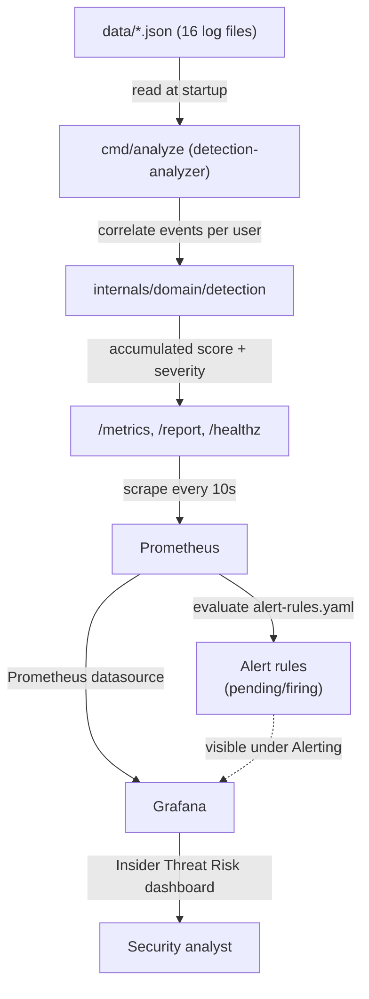
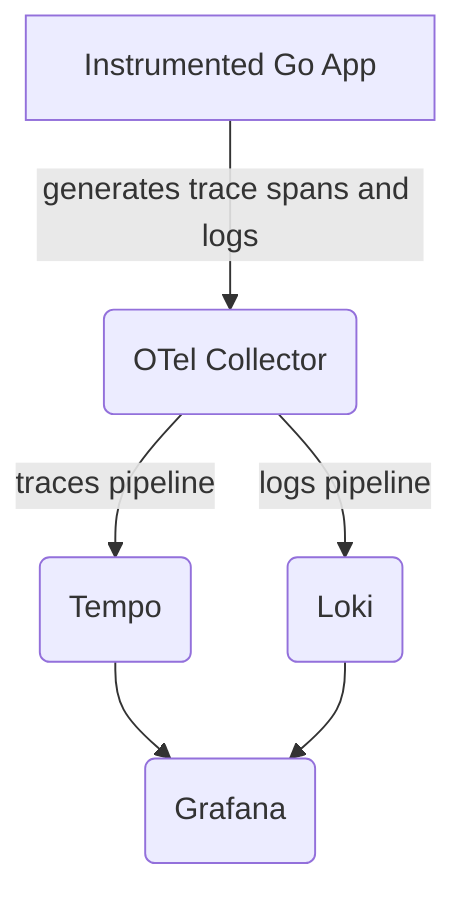

# Insider Threat Lab

This project demonstrates an observability setup using Docker Compose.
It includes services for monitoring, logging, and tracing using Prometheus, Tempo, Loki, and Grafana, plus a Go analyzer that detects insider-threat behavioral patterns.

## MVP Status

The first demonstrable version of the insider-threat detector is ready and validated locally:

- ✅ Analysis of the 16 log JSON files in [data/](data)
- ✅ Event correlation per user
- ✅ Accumulated score calculation and severity classification
- ✅ `/metrics`, `/report` and `/healthz` endpoints
- ✅ Prometheus integration for metrics scraping
- ✅ Alert rules (`config-files/alert-rules.yaml`)
- ✅ Grafana dashboard ([dashboards/insider-risk.json](dashboards/insider-risk.json))
- ✅ Automated tests and `go vet` passing
- ✅ Full stack validated end-to-end with `docker compose up -d`

## Services

- **detection-analyzer**: Analyzes the logs in `data/` and exposes `/metrics`, `/report` and `/healthz`.
- **Prometheus**: A monitoring system and time series database. Scrapes `detection-analyzer` and evaluates the alert rules.
- **Tempo**: A distributed tracing backend (kept for future trace ingestion; no app currently emits traces).
- **Loki**: A log aggregation system (kept for future log ingestion; no app currently emits logs).
- **OpenTelemetry Collector**: Collects telemetry data from various sources (currently idle, no instrumented app feeding it).
- **Grafana**: A visualization tool for metrics, logs, and traces. Provisioned with the Prometheus datasource and the Insider Threat Risk dashboard.

## Prerequisites

- Docker and Docker Compose installed on your machine.

## Usage

### Starting the Services

To start all services, run:

```bash
docker compose up -d
```

To start only the detection stack (analyzer + Prometheus), run:

```bash
docker compose up -d detection-analyzer prometheus
```

### Accessing the Services

- Prometheus: http://localhost:9090
- Grafana: http://localhost:3000 (Default login: admin/admin)

### Configuration

- Prometheus : Configuration file located at ./config-files/prometheus.yaml .
- Tempo : Configuration file located at ./config-files/tempo.yaml .
- Loki : Configuration file located at ./config-files/loki.yaml .
- OpenTelemetry Collector : Configuration file located at ./config-files/otel.yaml .
- Alert rules : Configuration file located at ./config-files/alert-rules.yaml .

### Stopping the Services

To stop all services, run:

```bash
docker compose down
```

### Project Structure

- **cmd/analyze** : Entry point of the insider-threat analyzer (`go run ./cmd/analyze`), which reads the logs in `data/`, applies the detection rules and exposes `/metrics`, `/report` and `/healthz`.
- **config-files** : Stores configuration files for the observability tools,
such as Loki, OpenTelemetry, Prometheus, Tempo, and the alert rules (`alert-rules.yaml`).
- **internals/domain/detection** : Contains the analyzer's business logic — event correlation, score calculation and severity classification.
- **dashboards** : Auto-provisioned Grafana dashboard (`insider-risk.json`).
- **docker-compose.yaml** : Defines the Docker services required to run the analyzer and the observability stack (Prometheus, Tempo, Loki, OpenTelemetry Collector and Grafana).
- **Dockerfile.analyzer** : Specifies how to build the analyzer's Go Docker image.

> Note: the example services (`service1/2/3` + Traefik) and the example code inherited from the base template (`internals/domain/usecase`, `internals/infra`, `internals/domain/core`, `cmd/main.go`) were removed since they were not part of the insider-threat-lab scope and were broken (they depended on a duplicated Go module under `pkg/`).

## End-to-End Flow

This is the full pipeline, from raw logs to an alert visible in Grafana:



### Step by step

1. **Log ingestion**: `detection-analyzer` starts with `--input-dir /app/data --listen :9464` (see [Dockerfile.analyzer](Dockerfile.analyzer)) and reads all 16 JSON files in [data/](data) (access logs, privileged access, mass deletions, hacking tools usage, large file transfers, etc.).
2. **Correlation and scoring**: [internals/domain/detection](internals/domain/detection) correlates events per `user_id`, accumulates a risk score, and classifies each finding by severity (`medium`, `high`, `critical`).
3. **Exposed endpoints**: the analyzer serves:
   - `GET /healthz` — liveness check (`ok`)
   - `GET /report` — full JSON report
   - `GET /metrics` — Prometheus-formatted metrics (`insider_events_total`, `insider_findings_total`, `insider_findings_by_severity`, `insider_user_risk_score`)
4. **Metrics scraping**: Prometheus scrapes `detection-analyzer:9464` every 10s (job `insider-threat-analyzer` in [config-files/prometheus.yaml](config-files/prometheus.yaml)).
5. **Alert evaluation**: Prometheus loads [config-files/alert-rules.yaml](config-files/alert-rules.yaml) and continuously evaluates:
   - `InsiderThreatCriticalUser` — `insider_user_risk_score{severity="critical"} >= 6` for 5m
   - `InsiderThreatHighUser` — `insider_user_risk_score{severity="high"} >= 4` for 10m
   - `InsiderThreatCriticalFindings` — `insider_findings_by_severity{severity="critical"} > 0` for 5m
6. **Visualization**: Grafana is auto-provisioned with the Prometheus datasource ([config-files/grafana/provisioning/datasources](config-files/grafana/provisioning/datasources)) and the **Insider Threat Risk** dashboard ([dashboards/insider-risk.json](dashboards/insider-risk.json)), placed under the **Security** folder ([config-files/grafana/provisioning/dashboards](config-files/grafana/provisioning/dashboards)).
7. **Verification**: the loaded alert rules and their current state (`inactive`, `pending`, `firing`) can be checked at `http://localhost:9090/alerts` or in Grafana under **Connections → Data sources → Prometheus → Alerting → Alert rules**.

### Tracing/Logs pipeline (Tempo/Loki/OTel Collector)

Tempo, Loki, and the OpenTelemetry Collector remain part of the stack for future use (e.g., instrumenting the analyzer or another app with traces/logs), but no service currently emits data to them:


