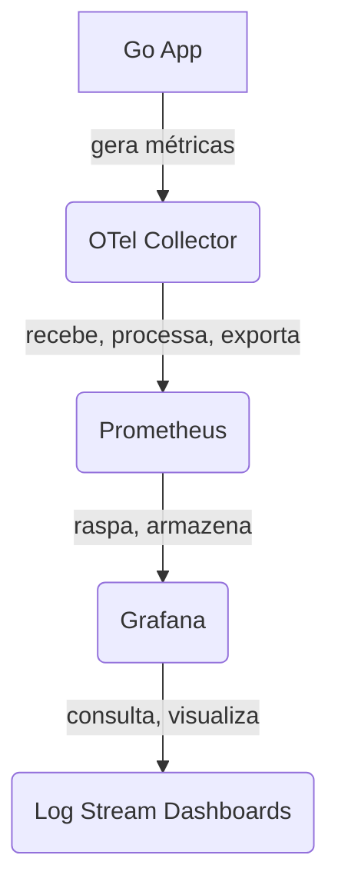

# Observability Go Example

This project demonstrates an observability setup using Docker Compose.
It includes services for monitoring, logging, and tracing using Traefik, Prometheus, Tempo, Loki, and Grafana.

## Services

- **Traefik**: A reverse proxy and load balancer.
- **Service1, Service2, Service3**: Example services that are routed through Traefik.
- **Prometheus**: A monitoring system and time series database.
- **Tempo**: A distributed tracing backend.
- **Loki**: A log aggregation system.
- **OpenTelemetry Collector**: Collects telemetry data from various sources.
- **Grafana**: A visualization tool for metrics, logs, and traces.

## Prerequisites

- Docker and Docker Compose installed on your machine.

## Usage

### Starting the Services

To start all services, run:

```bash
docker-compose up -d
```

### Accessing the Services

- Traefik: http://localhost:8080
- Prometheus: http://localhost:9090
- Grafana: http://localhost:3000 (Default login: admin/lS071134)

### Configuration

- Traefik : Configured to route traffic to services based on path prefixes.
- Prometheus : Configuration file located at ./config-files/prometheus.yaml .
- Tempo : Configuration file located at ./config-files/tempo.yaml .
- Loki : Configuration file located at ./config-files/loki.yaml .
- OpenTelemetry Collector : Configuration file located at ./config-files/otel.yaml .

### Accessing a specific Service

To run and visualize Service1, use the following command:

```bash
curl http://localhost:8081/service1
```

### Stopping the Services

To stop all services, run:

```bash
docker-compose down
```

### Estrutura do Projeto

- **cmd** : Contém o ponto de entrada da aplicação, que é implementado usando o cobra-cli . 
O arquivo serve.go define o comando para iniciar o serviço HTTP instrumentado com OpenTelemetry.
- **config-files** : Armazena arquivos de configuração para as ferramentas de observabilidade, 
como Loki, OpenTelemetry, Prometheus e Tempo. Esses arquivos definem como cada ferramenta deve ser 
configurada e integrada ao projeto.
- **internals** : Contém a lógica de negócio e a infraestrutura da aplicação.
  - _domain_ : Define as entidades e interfaces principais do domínio da aplicação. Por exemplo, Example representa uma entidade de domínio.
  - _usecase_ : Implementa os casos de uso da aplicação, que são as operações principais que a aplicação pode realizar.
  - _infra_ : Contém a implementação dos controladores e repositórios que interagem com o mundo externo.
- **pkg** : Contém adaptadores para entrada e saída de dados, além da configuração de injeção de dependência.
  - _adapter_ : Implementa a instrumentação, métricas e endpoints REST.
  - _di_ : Configura a injeção de dependência, criando instâncias dos controladores e casos de uso.
- **docker-compose.yaml** : Define os serviços Docker necessários para executar a aplicação e as ferramentas de 
observabilidade. Inclui serviços como Traefik, Prometheus, Tempo, Loki, OpenTelemetry Collector e Grafana.
- **Dockerfile** : Especifica como construir a imagem Docker da aplicação Go, incluindo a instalação de dependências e a compilação do binário.
- **Ports** : Representadas pelas interfaces definidas no pacote domain . Elas definem os contratos que os adaptadores devem implementar para interagir com a lógica de negócio.
- **Adapters** : Implementados nos pacotes infra e pkg . Eles adaptam as interfaces externas (como HTTP e OpenTelemetry) para as interfaces internas definidas no domínio.
- **Core** : Contém a lógica de negócio central, implementada nos pacotes domain e usecase . Essa camada é independente de frameworks e bibliotecas externas, facilitando testes e manutenção.
  
Essa estrutura permite que a aplicação seja facilmente extensível e testável, além de facilitar a integração com ferramentas de observabilidade para monitoramento e análise de desempenho.

### How Does It Work?



### Fluxo de Dados de Tracing e Logs

1. __Aplicação Go__: Gera spans de trace e logs estruturados para cada requisição. O TraceID é a "cola" que liga tudo.
2. __OpenTelemetry Collector__: Recebe traces e logs da aplicação na porta 4318.
 - O pipeline de traces envia os dados para o Tempo.
 - O pipeline de logs envia os dados para o Loki.
3. __Grafana__: Usa as fontes de dados do Tempo e do Loki para visualizar os traces e os logs.
